<div align="center">
  
</div>

# Git Recon

[](https://python.org)
[](LICENSE)

> **GitHub intelligence gatherer — org recon, secret scanning via code search, and member enumeration.**

## Usage

```bash
# Org recon (repos, members)
python git_recon.py --token $GITHUB_TOKEN org target-org --out org.json

# Search for secrets in a GitHub org
python git_recon.py --token $GITHUB_TOKEN search "org:target-org password filename:.env"
```

## Disclaimer

> **Authorized security testing only.** Requires a GitHub token. Only search orgs you have written authorization to test.

## Author

**Omar Khalid** — [omareldemery.com](https://omareldemery.com) | [@amooryx](https://github.com/amooryx)
